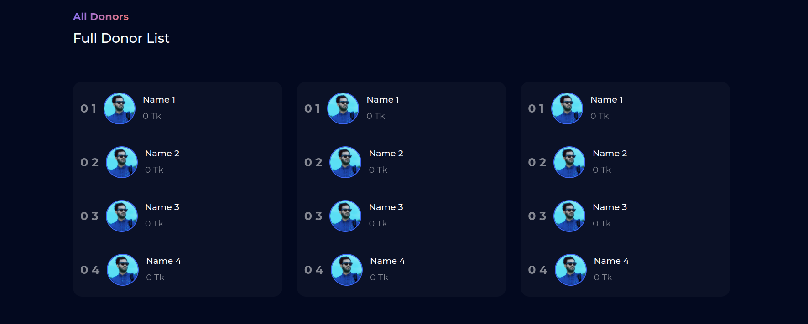
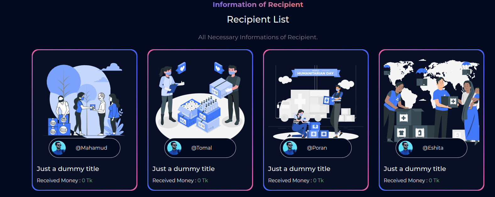
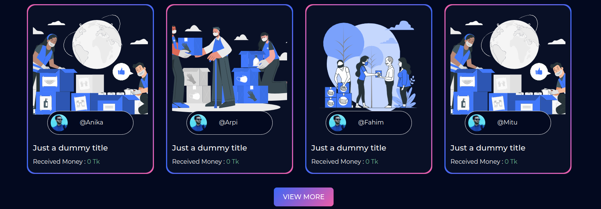

## RAMDAN-DONATION 🌅 ☪️


##### Header & First Page


##### Donors Show Page



##### Information of Recipient



##### Recipient List View More



##### Conatct Page


##### Footer


## Run it Locally
```
$ git clone https://github.com/MahamudM90/Ramdan-Donation
$ cd Ramdan-Donation
$ npm install
$ npm start
$ Open http://localhost:3000
